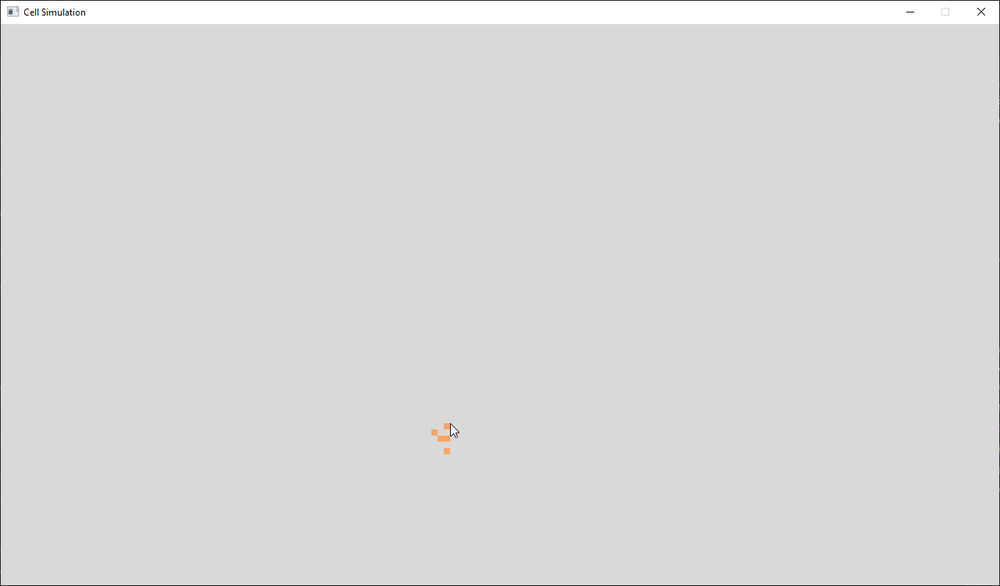
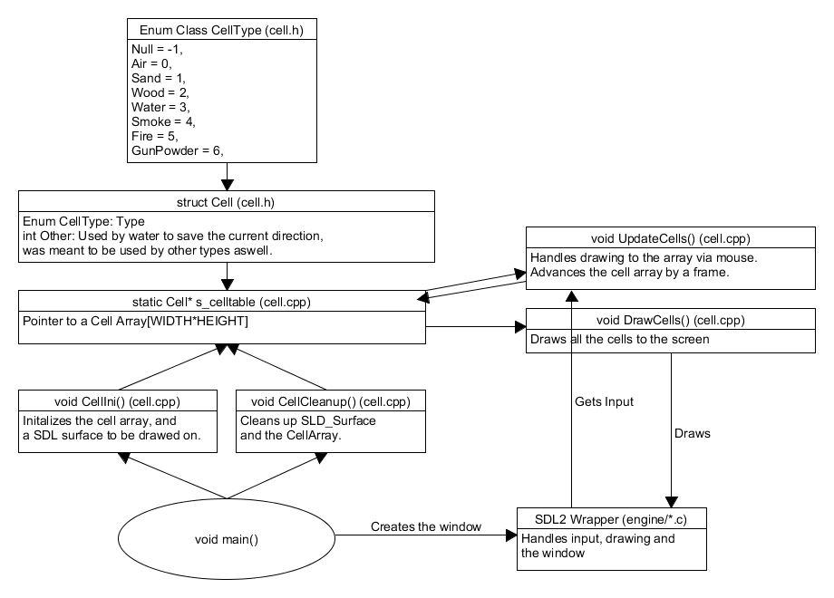

#  
 Pixel Simulation

This is a simple pixelsimulatation modeled by [cellular automaton](https://en.wikipedia.org/wiki/Cellular_automaton), which is made in C++ using [SDL2](https://www.libsdl.org/) graphics library.  
This project is one of my school projects, so most of the comments will be in finnish for the time being. Does not use any classes so this could be easily translated to pure C.

# Controls
**Restart**: Escape  
**Randomize Array**: Enter, randomizes the cells with your current selection  
**Place a Cell:** Left Mouse Button  
**Erase a Cell:** Right Mouse Button  
**Advance Time:** Spacebar
**Hide UI:** F1  
### Cell Selection:
**1:** Sand  
**2:** Water  
**3:** Wood  
**4:** GunPowder  
**5:** Fire

# Compiling
## Window:
Make sure you have c/c++ development tools installed for [Visual Studio 2019](https://visualstudio.microsoft.com/).
Open game.sln with Visual Studio 2019 and compile.

## Linux:
With linux you have to install all dependencies with  
**Debian/Ubuntu**: "sudo apt update && sudo apt install gcc libsdl2-dev libsdl2-image-dev libsdl2-ttf-dev make"    

Compile by typing "make" in the projects root directory.

# Design

